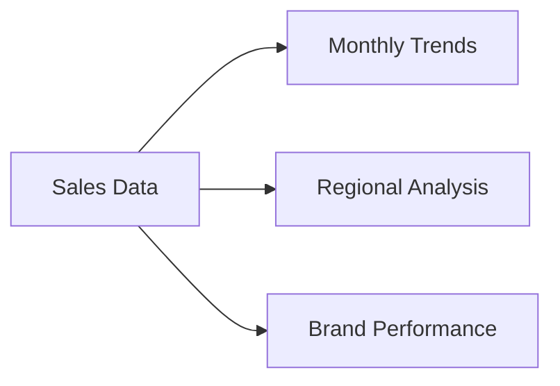

# 🚗 Automobile Market Research Analysis

<a href="#-project-overview">Overview</a> •
<a href="#-features">Features</a> •
<a href="#-getting-started">Getting Started</a> •
<a href="#-contact">Contact</a>

<h2>📊 Project Overview</h2>

A comprehensive analysis of the automobile market using Power BI to provide actionable insights for stakeholders. This project visualizes and analyzes key market trends, consumer behavior, and vehicle performance metrics.

### 🎯 Key Objectives
- 📈 Analyze automotive sales patterns
- 👥 Identify customer preferences
- 🚙 Evaluate performance metrics
- 📊 Enable data-driven decisions

<h2>📋 Features</h2>

### 🎯 Sales Analysis

### 👥 Customer Insights
- Demographics Analysis
- Purchase Patterns
- Price Sensitivity

### 🚗 Vehicle Metrics
| Metric | Analysis Type |
|--------|---------------|
| Fuel Efficiency | Comparison |
| Price Range | Distribution |
| Features | Popularity |

<h2>⚙️ Technical Stack</h2>

| Tool | Purpose |
|------|----------|
|  | Data Visualization |
|  | Data Processing |

<h2>📈 Key Insights</h2>

### Market Trends
- 🚀 Growth patterns
- 📊 Segment analysis
- 💹 Price trends

### Consumer Behavior
- 🎯 Target demographics
- 💡 Preferences
- 💰 Budget distribution

## 📫 Connect With Me

---

Made with ❤️ by <a href="https://www.linkedin.com/in/amit-kumar-5221ab312/">Amit Kumar</a>

